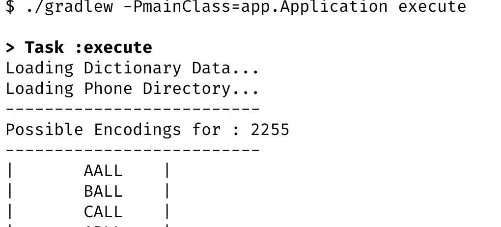

# Fancy-Toll-Free-Number-Generator

**Problem Statement**
Many companies like to list their phone numbers using the letters printed on most
telephones. This makes the number easier to remember for customers. An example
may be 1-800-FLOWERS

Your program should be a command line application that reads from [phone_numbers.txt](src/main/resources/phone-numbers.txt)  or STDIN when no files are given. Each line of these files will
contain a single phone number.

For each phone number read, your program will output all possible word
replacements from [dictionary.conf](src/main/resources/dictionary/dictionary.conf)

All punctuation and whitespace will be ignored in both phone numbers and the
dictionary file. Output of this will be a capital letters and digits separated at word boundaries with a single dash (-),
one possible word encoding per line. 

**How to run**

 ```
./gradlew build
./gradlew -PmainClass=app.Application execute
```


